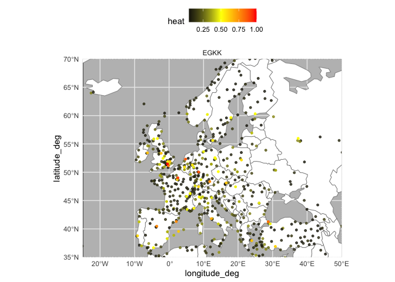
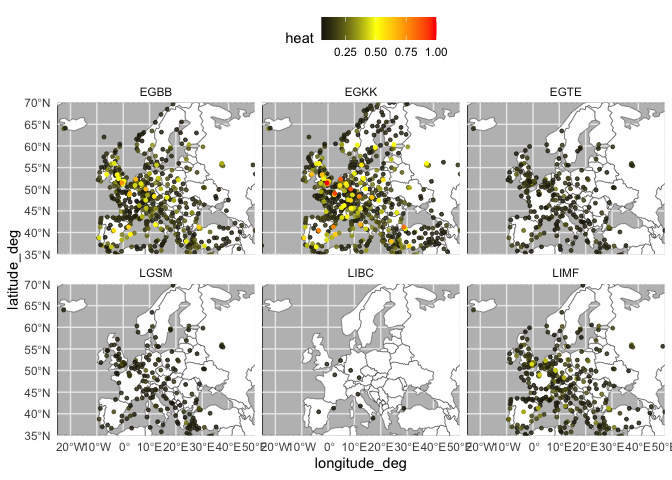
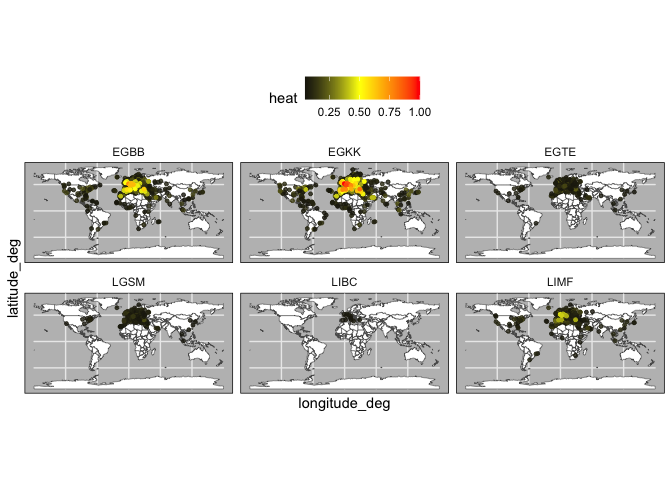
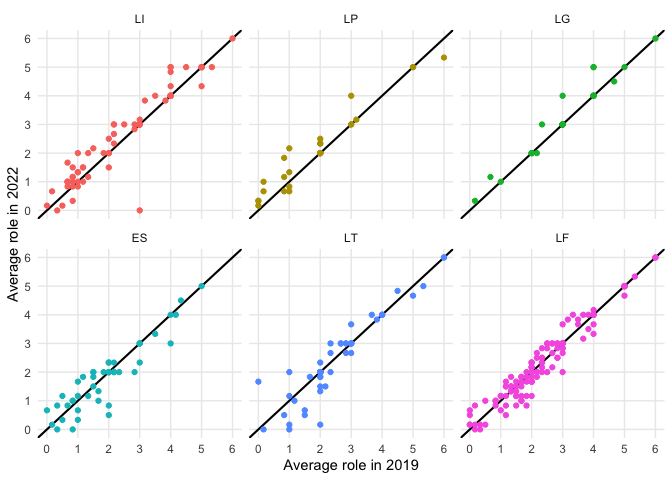
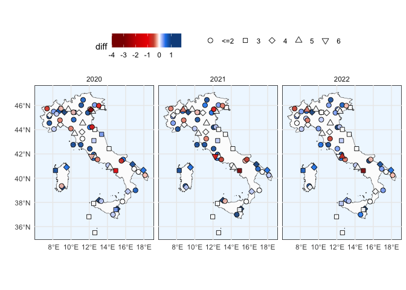
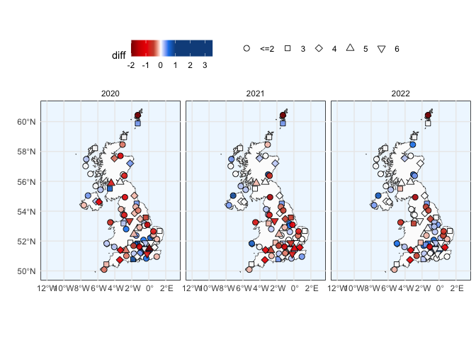

<!-- README.md is generated from README.Rmd. Please edit that file -->

# Introduction

This is the companion repository for the paper (Vossen et al. 2023) we
submitted to the *2023 Integrated Communication, Navigation and
Surveillance Conference (ICNS)*.

Our work uses GraphWave (Donnat et al. 2018) to analyse the European
Aviation network and to highlight the structural impacts on it by the
COVID-19 pandemic.

You can find here

- a subset of the data, six weeks of flight list data in 2019, 2020,
  2021, and 2022
- the code to reproduce the model for the paper (and the provided data
  subset)
- the validation paper of the used model

## Setup

We suggest you to create a dedicated conda environment for this project,
we refer to it as `aviation-network` in the following paragraphs.

Note that we use Python 3.9 even if the GraphWave repo states it was
developed in 2.7 (and we define do NOT use version 2.1 of `networkx` as
per the [GraphWave
repo](https://github.com/snap-stanford/graphwave/blob/master/requirements.txt)).
So to make `graphwave` import-able we have to fix the print statements
in `graphwave/utils/graph_tools.py` from `print "message"` to
`print("message")`

``` shell
$ conda create -n aviation-network python=3.9 \
    numpy networkx pandas scikit-learn pillow=9.0.0 \
    matplotlib seaborn pyemd pygsp
```

Clone (or copy the relevant folder) [`graphwave` source
code](https://github.com/snap-stanford/graphwave) in the parent
directory of this project.

``` text
<somewhere>
├── aviation-network-structure-model
│   ├── data
│   │   ├── ...
│   │   └── sample_2022.csv
│   └── sample_code_for_repo.R
│   └── ...
└── graphwave
    ├── graphwave
    │   └── ...
    └── requirements.txt
```

## Description

You can run the script `sample_code_for_repo.R` to reproduce the
analysis of the paper on the sample data.

But the same code will be explained in the little by little here.

Here we provide with sample code and data to run the analyses as
described in the “*Studying the impact of COVID-19 on the European Air
Transportation Network”* (Vossen et al. 2023). This sample code uses a
combination of R and Python; GraphWave (Donnat et al. 2018), the
unsupervised method for learning node embeddings based on structural
similarity in networks, is implemented in Python.

``` r
library(data.table)
library(tidyverse)
#> ── Attaching core tidyverse packages ──────────────────────── tidyverse 2.0.0 ──
#> ✔ dplyr     1.1.2     ✔ readr     2.1.4
#> ✔ forcats   1.0.0     ✔ stringr   1.5.0
#> ✔ ggplot2   3.4.2     ✔ tibble    3.2.0
#> ✔ lubridate 1.8.0     ✔ tidyr     1.3.0
#> ✔ purrr     1.0.1     
#> ── Conflicts ────────────────────────────────────────── tidyverse_conflicts() ──
#> ✖ dplyr::between()     masks data.table::between()
#> ✖ dplyr::filter()      masks stats::filter()
#> ✖ dplyr::first()       masks data.table::first()
#> ✖ lubridate::hour()    masks data.table::hour()
#> ✖ lubridate::isoweek() masks data.table::isoweek()
#> ✖ dplyr::lag()         masks stats::lag()
#> ✖ dplyr::last()        masks data.table::last()
#> ✖ lubridate::mday()    masks data.table::mday()
#> ✖ lubridate::minute()  masks data.table::minute()
#> ✖ lubridate::month()   masks data.table::month()
#> ✖ lubridate::quarter() masks data.table::quarter()
#> ✖ lubridate::second()  masks data.table::second()
#> ✖ purrr::transpose()   masks data.table::transpose()
#> ✖ lubridate::wday()    masks data.table::wday()
#> ✖ lubridate::week()    masks data.table::week()
#> ✖ lubridate::yday()    masks data.table::yday()
#> ✖ lubridate::year()    masks data.table::year()
#> ℹ Use the conflicted package (<http://conflicted.r-lib.org/>) to force all conflicts to become errors
library(foreach)
#> 
#> Attaching package: 'foreach'
#> 
#> The following objects are masked from 'package:purrr':
#> 
#>     accumulate, when
library(fdm2id)
#> Loading required package: arules
#> Loading required package: Matrix
#> 
#> Attaching package: 'Matrix'
#> 
#> The following objects are masked from 'package:tidyr':
#> 
#>     expand, pack, unpack
#> 
#> 
#> Attaching package: 'arules'
#> 
#> The following object is masked from 'package:dplyr':
#> 
#>     recode
#> 
#> The following objects are masked from 'package:base':
#> 
#>     abbreviate, write
#> 
#> Loading required package: arulesViz
#> Loading required package: FactoMineR
#> 
#> Attaching package: 'fdm2id'
#> 
#> The following objects are masked from 'package:FactoMineR':
#> 
#>     CA, MCA, PCA
library(pruatlas)
library(rnaturalearth)
library(Partiallyoverlapping)
library(reticulate)
library(here)
#> here() starts at C:/Users/spi/dev/repos/aviation-network-structure-model
library(flexclust)
#> Loading required package: grid
#> Loading required package: lattice
#> Loading required package: modeltools
#> Loading required package: stats4
#> 
#> Attaching package: 'modeltools'
#> 
#> The following object is masked from 'package:arules':
#> 
#>     info

set.seed(42)


# Load Python packages
use_condaenv("aviation-network", required = TRUE)
graphwave <- import_from_path(module = "graphwave", path = here("..", "graphwave", "graphwave"))
np <- import("numpy")
nx <- import("networkx")
pd <- import("pandas")
sk <- import("sklearn")
```

The data consist of origin-destination flight data for flights departing
from, or arriving at airports in EUROCONTROL member states of six weeks
(i.e, week 26 to 31) in 2019, 2020, 2021 and 2022 is provided. Each
flight is classified using the statfor market segment classification
(i.e., Low-cost, Mainline, Regional, Business, Non-scheduled, Military,
and Other).

``` r
net2019 <- fread(file = here("data", "sample_2019.csv"))
net2020 <- fread(file = here("data", "sample_2020.csv"))
net2021 <- fread(file = here("data", "sample_2021.csv"))
net2022 <- fread(file = here("data", "sample_2022.csv"))

weeks <- net2019$week%>%unique()
n_weeks <- weeks%>%length()

extract_airports <- function(net) {
  airports_to <- net %>%
    filter(
      type.destination %in% c("medium_airport", "large_airport") &
        !to_member_status == ""
    ) %>%
    select(destination) %>% unique() %>% unlist()
  airports_from <- net %>%
    filter(type.origin %in% c("medium_airport", "large_airport") &
             !from_member_status == "") %>%
    select(origin) %>% unique() %>% unlist()
  airports <- c(airports_from, airports_to) %>% unique()
  return(airports)
}

airports19 <- extract_airports(net2019)
airports20 <- extract_airports(net2020)
airports21 <- extract_airports(net2021)
airports22 <- extract_airports(net2022)

head(net2019)
#>    origin destination week market_segment type.origin type.destination
#> 1:   AFIL        EDDK   28          Other                large_airport
#> 2:   AFIL        EDDV   30          Other                large_airport
#> 3:   AFIL        EDLE   28          Other                small_airport
#> 4:   AFIL        EDTD   29       Business               medium_airport
#> 5:   AFIL        EGXW   29       Military               medium_airport
#> 6:   AFIL        EGXW   30       Military               medium_airport
#>    from_member_status to_member_status weight
#> 1:                                   M      1
#> 2:                                   M      1
#> 3:                                   M      1
#> 4:                                   M      1
#> 5:                                   M      1
#> 6:                                   M      1
```

Before running the analysis we remove entries containing airports with
code AFIL and ZZZZ, as these codes do not relate to actual airports, but
are unique identifiers of flight plans that are received in-flight, and
unidentified origins. Leaving these connections in the network can
result in artifical connections between otherwise unconnected regions
(i.e., two airports sharing the same neighbor ZZZ or AFIL).
Additionally, as we are interested in connectivity between airports, we
remove self loops (i.e., flights originating and arriving at the same
airport).

``` r
preprocess_network <-
  function(net,
           remove_self_loops = TRUE,
           remove_AFIL_ZZZZ = TRUE) {
    if (remove_self_loops == TRUE) {
      net <- net %>% filter(origin != destination)
    }
    
    if (remove_AFIL_ZZZZ == TRUE) {
      net <- net %>% filter(!origin %in% c("AFIL", "ZZZZ") &
                              !destination %in% c("AFIL", "ZZZZ"))
    }
    
    return(net)
  }

net2019 <- preprocess_network(net2019)
net2020 <- preprocess_network(net2020)
net2021 <- preprocess_network(net2021)
net2022 <- preprocess_network(net2022)
```

### Step 1: GraphWave analysis

The first step in the analysis consists of running the GraphWave
algorithm on our networks. The GraphWave algorithm takes as input a
graph object that we create using networkx.

``` r
# label: create-networks
# echo: true
create_nx_graph <- function(net, weighted = TRUE) {
  net <-
    net %>% select(origin, destination, weight) %>% as.data.frame() %>%
    rename(source = origin,
           target = destination)
  
  net <- pd$DataFrame(net)
  if (weighted == TRUE) {
    g <-
      nx$from_pandas_edgelist(net,
                              edge_attr = TRUE,
                              create_using = nx$DiGraph)
    
  } else {
    g <- nx$from_pandas_edgelist(net[, 1:2], create_using = nx$DiGraph)
    
  }
  
  return(g)
}
nodes_to_string <- function(nodes) {
  nodes <- toString(nodes)
  nodes <- substr(nodes, 3, nchar(nodes) - 2)
  nodes <- stringr::str_remove_all(nodes, "'")
  nodes <- stringr::str_split(nodes, ", ")[[1]]
  return(nodes)
}
```

Starting with 2019, we create an embedding of each week in our dataset.
As 2019 will be our reference for the study, we set `taus` option of the
GraphWave algoritm to “auto”. This allows the algorithm to find the
optimal signal to propagate through the network.

``` r
embeddings_2019 <- list()
taus_2019 <- list()

for (wk in weeks) {
  #print(paste("Processing week", wk))
  el <- create_nx_graph(net2019 %>% filter(week == wk))
  emb <-
    graphwave$graphwave_alg(el,
                            seq(0, 100, length.out = 25),
                            taus = "auto",
                            verbose = F)
  embedding <- emb[[1]] %>% as.data.frame()
  embedding$name <- nodes_to_string(el$nodes)
  embeddings_2019[[wk]] <- embedding
  taus_2019[[wk]] <- emb[[3]]
}
```

For the networks in the weeks in 2020-2022, we now use the optimal tau
values from the baseline network. This way we can compare our target
weeks under the same conditions as our reference weeks.

``` r
embeddings_2020 <- list()
for (wk in weeks) {
  #print(paste("Processing week", wk))
  el <- create_nx_graph(net2020 %>% filter(week == wk))
  emb <-
    graphwave$graphwave_alg(el,
                            seq(0, 100, length.out = 25),
                            taus = taus_2019[[wk]],
                            verbose = F)
  embedding <- emb[[1]] %>% as.data.frame()
  embedding$name <- nodes_to_string(el$nodes)
  embeddings_2020[[wk]] <- embedding
}

embeddings_2021 <- list()
for (wk in weeks) {
  #print(paste("Processing week", wk))
  el <- create_nx_graph(net2021 %>% filter(week == wk))
  emb <-
    graphwave$graphwave_alg(el,
                            seq(0, 100, length.out = 25),
                            taus = taus_2019[[wk]],
                            verbose = F)
  embedding <- emb[[1]] %>% as.data.frame()
  embedding$name <- nodes_to_string(el$nodes)
  embeddings_2021[[wk]] <- embedding
}

embeddings_2022 <- list()
for (wk in weeks) {
  #print(paste("Processing week", wk))
  el <- create_nx_graph(net2022 %>% filter(week == wk))
  emb <-
    graphwave$graphwave_alg(el,
                            seq(0, 100, length.out = 25),
                            taus = taus_2019[[wk]],
                            verbose = F)
  embedding <- emb[[1]] %>% as.data.frame()
  embedding$name <- nodes_to_string(el$nodes)
  embeddings_2022[[wk]] <- embedding
}
```

### Step 2: K-means clustering

To find the structural roles in the network, we first run a k-means
clustering algorithm to find clusters of airports that have a similar
heat propagation signature. We make use of the Calinski-Harabasz index
to evaluate the optimal number of clusters.

``` r
create_scree_plot <- function(data, k_centers) {
  wcss <- list()
  ch_index <- list()

  # fit the k-means model for different values of the number of clusters
  for (i in 1:k_centers) {
    kmeans_fit <- kmeans(data, centers = i, iter.max = 50)
    wcss[[i]] <- kmeans_fit$tot.withinss
    
    if (i > 1) {
      ch_index[[i]] <-
        sk$metrics$calinski_harabasz_score(data, kmeans_fit$cluster)
    }
  }
  
  # plot the WCSS values against the number of clusters
  plot(
    1:k_centers,
    unlist(wcss),
    type = "b",
    main = "Elbow Method",
    xlab = "Number of clusters",
    ylab = "Within-cluster sum of squares"
  )
  
  return(list(
    wcss = unlist(wcss),
    ch_index = unlist(ch_index)
  ))
}

clustering_index <- list()
for (i in weeks) {
  clustering_index[[i]] <-
    create_scree_plot(embeddings_2019[[i]][, 1:100], k_centers = 20)
}
```

<!-- --><!-- --><!-- --><!-- --><!-- --><!-- -->

``` r

clust <- do.call(rbind, clustering_index)
```

``` r
data.frame(
  ch_index = do.call(c, clust[, 2]),
  n_clust = rep(2:20, n_weeks),
  week = foreach(i = weeks, .combine = c) %do% {
    rep(i, 19)
  }
) %>%
  group_by(n_clust) %>%
  mutate(group_mean = mean(ch_index)) %>%
  group_by(week) %>%
  ggplot(aes(x = n_clust, group = week)) +
  geom_line(aes(y = ch_index), alpha = .2) +
  scale_x_continuous(breaks = 2:20) +
  geom_line(aes(y = group_mean), lwd = 1.5) +
  theme_minimal() +
  xlab("# of cluster centers") +
  ylab("Calinski-Harabasz  Index")
```

<!-- -->

Even these 6 consecutive weeks show variability in the optimal number of
clusters. To find the optimal number of clusters for this timeperiod we
rank each clustering solution based on its ch index score and average
each rank score across the weeks.

``` r
data.frame(
  ch_index = do.call(c, clust[, 2]),
  n_clust = rep(2:20, n_weeks),
  week = foreach(i = weeks, .combine = c) %do% {
    rep(i, 19)
  }
) %>%
  group_by(week) %>%
  reframe(rank = rank(ch_index),
          ch_index = ch_index,
          n_clust = n_clust) %>%
  group_by(n_clust) %>%
  summarise(rank = mean(rank)) %>%
  arrange(desc(rank))%>%
  slice(1:5)
#> # A tibble: 5 × 2
#>   n_clust  rank
#>     <int> <dbl>
#> 1       6  17  
#> 2       7  17  
#> 3       8  16  
#> 4       5  14.2
#> 5      12  14.2
```

Next we use the optimal number of clusters we create a model for each
week that classifies each airport in the network based on its heat
propagation signature. One issue with using multiple baseline models
(i.e., one for each week), is that k-means predictions have no inherent
sense of ordinality, meaning that for instance the largest airports do
not always end it in the cluster with the largest value. To circumvent
this problem, we use a heuristic using PCA to reduce our signals to 2
dimensions and fix the axes as such that the largest airport is in the
(“LFTM”) is in the top right corner, as such that increase in pca
dimension 1 relates to airports with increasing levels of connectivity.

Clusters are then renamed based on their occurrence on the pca dimension
1, as such that the cluster containing the least connective airports get
assigned 1, and the cluster with the most connective airports are
assigned 6. This approach works for six clusters, as the change in
connectivity is nicely captured by PCA dimension 1. Note that with
overlapping clusters, a different approach should be tried.

``` r
generate_clusters <- function(data, kmeans_model) {
  data$cluster <- predict(kmeans_model, data[, 1:100])
  pca1 <- prcomp(data[, 1:100])$x[, 1]
  pca2 <- prcomp(data[, 1:100])$x[, 2]
  
  if (pca1[data$name == "LTFM"] < 0) {
    pca1 <- -pca1
  }
  if (pca2[data$name == "LTFM"] < 0) {
    pca2 <- -pca2
  }

  clustering <- data[, 101:102] %>% left_join(
    data.frame(pca1, pca2, data$cluster) %>%
      arrange(pca1) %>% select(data.cluster) %>% unique() %>%
      mutate(clust = unique(1:n())) %>%
      rename(cluster = data.cluster)
  ) %>%
    select(name, clust)
  
  return(clustering)
}
```

``` r

clust6_kmeans_models <- list()
for (i in weeks) {
  clust6_kmeans_models[[i]] <-
    kmeans(embeddings_2019[[i]][, 1:100], 6)
}

net2019_clust_list <- list()
net2020_clust_list <- list()
net2021_clust_list <- list()
net2022_clust_list <- list()

for (i in weeks) {
  net2019_clust <-
    generate_clusters(embeddings_2019[[i]], clust6_kmeans_models[[i]])
  net2020_clust <-
    generate_clusters(embeddings_2020[[i]], clust6_kmeans_models[[i]])
  net2021_clust <-
    generate_clusters(embeddings_2021[[i]], clust6_kmeans_models[[i]])
  net2022_clust <-
    generate_clusters(embeddings_2022[[i]], clust6_kmeans_models[[i]])
  
  net2019_clust$week <- i
  net2020_clust$week <- i
  net2021_clust$week <- i
  net2022_clust$week <- i
  
  net2019_clust$year <- 2019
  net2020_clust$year <- 2020
  net2021_clust$year <- 2021
  net2022_clust$year <- 2022
  
  net2019_clust_list[[i]] <-
    net2019_clust
  net2020_clust_list[[i]] <-
    net2020_clust
  net2021_clust_list[[i]] <-
    net2021_clust
  net2022_clust_list[[i]] <-
    net2022_clust
}
#> Joining with `by = join_by(cluster)`
#> Joining with `by = join_by(cluster)`
#> Joining with `by = join_by(cluster)`
#> Joining with `by = join_by(cluster)`
#> Joining with `by = join_by(cluster)`
#> Joining with `by = join_by(cluster)`
#> Joining with `by = join_by(cluster)`
#> Joining with `by = join_by(cluster)`
#> Joining with `by = join_by(cluster)`
#> Joining with `by = join_by(cluster)`
#> Joining with `by = join_by(cluster)`
#> Joining with `by = join_by(cluster)`
#> Joining with `by = join_by(cluster)`
#> Joining with `by = join_by(cluster)`
#> Joining with `by = join_by(cluster)`
#> Joining with `by = join_by(cluster)`
#> Joining with `by = join_by(cluster)`
#> Joining with `by = join_by(cluster)`
#> Joining with `by = join_by(cluster)`
#> Joining with `by = join_by(cluster)`
#> Joining with `by = join_by(cluster)`
#> Joining with `by = join_by(cluster)`
#> Joining with `by = join_by(cluster)`
#> Joining with `by = join_by(cluster)`

net2019_clust <- do.call(rbind, net2019_clust_list)
net2020_clust <- do.call(rbind, net2020_clust_list)
net2021_clust <- do.call(rbind, net2021_clust_list)
net2022_clust <- do.call(rbind, net2022_clust_list)
```

### Step 3: Visualize heat propagation

To visualize the heat propagation for a given airport in a given week,
we need to access the heat signatures that are stored in the graphwave
embedding. Each tau given to the algorithm, or two if the default
setting is used, has a heat signature related to it.

``` r
airports <- fread(here("data", "airports_20221025.csv"))
node.coords <- airports[, c("ident", "latitude_deg", "longitude_deg", "type")]
net <- net2019%>%filter(week == weeks[1])

el <- create_nx_graph(net)
emb <- graphwave$graphwave_alg(el,seq(0,100,length.out = 25),taus = "auto",verbose = TRUE)

embedding <- emb[[1]]%>%as.data.frame()
embedding$name <- nodes_to_string(el$nodes)
embedding <- embedding%>%filter(name %in% airports19)

heat_df_lower <- pd$DataFrame(emb[[2]][[1]]$toarray())
heat_df_upper <- pd$DataFrame(emb[[2]][[2]]$toarray())
heat_df <- (heat_df_lower + heat_df_upper)/2 
heat_df <- heat_df_upper 
heat_df$name <- nodes_to_string(el$nodes)
```

Each row in the data.frame represent the amount of energy that is sent
from a given airport to each other airport in the network (which are
represented by the columns). The following code allows us to create a
plot that shows the heat that is being propagated from a focal airport.

``` r
heat_by_airport <- heat_df%>%filter(name %in% c("LIBC","LGSM",'EGTE',"LIMF","EGBB","EGKK"))%>%reshape2::melt()
#> Using name as id variables
heat_by_airport$variable <- heat_by_airport$variable%>%as.character()%>%as.numeric()

heat_by_airport <- heat_by_airport%>%left_join(data.frame(variable = 0:(nrow(heat_df)-1),
                                                          target = heat_df$name))%>%
  rename(focal_airport = name)
#> Joining with `by = join_by(variable)`

plot_heat <- function(df,what = "EU"){
  world <- ne_countries(scale = "small", returnclass = "sf")
  data = left_join(node.coords,df,by=c("ident" = "target"))
  
  p <- ggplot(world) +
  geom_sf(fill = "white") +
  geom_point(aes(y = latitude_deg, x = longitude_deg,col=value),
             data%>%
               filter(!is.na(value) & value <= .35 & value > .05),
             size=1,alpha = .8) + 
  geom_point(aes(y = latitude_deg, x = longitude_deg,col=value),
             data%>%
               filter(!is.na(value) & value <= .45 & value > .35),
             size=1,alpha = 1) + 
  geom_point(aes(y = latitude_deg, x = longitude_deg,col=value),
             data%>%
               filter(!is.na(value) & value <= .65 & value > .45),
             size=1,alpha = 1) + 
  geom_point(aes(y = latitude_deg, x = longitude_deg,col=value),
             data%>%
               filter(!is.na(value) & value > .65),
             size=1) + scale_color_gradient2(high="red",mid="yellow",low = "black",midpoint = .5)+ 
  facet_wrap(~focal_airport)+theme_minimal()+
  labs(color = "heat")+
  theme(panel.background = element_rect(fill = "grey"),legend.position = "top")
  
  if(what == "EU"){
    p + coord_sf(xlim = c(-25,50), ylim = c(35,70), expand = FALSE)
  } else {
    p
  }
}
```

Specifically, the code normalizes the energy to show which airports have
are the most strongly connected (i.e., receive the most energy).

``` r
heat_EGKK <- heat_by_airport%>%
  filter(focal_airport == "EGKK")%>%
  mutate(value = (value - min(value))/(max(value) - min(value)))%>%arrange(desc(value))

plot_heat(heat_EGKK,what = "EU")
```

<!-- -->

``` r
plot_heat(heat_EGKK,what = "world")
```

<!-- -->

Note that when we include multiple airports, the normalization now
compares the amount heat propagated between the airports.

``` r
heat_norm <- heat_by_airport%>%
  mutate(value = (value - min(value))/(max(value) - min(value)))%>%arrange(desc(value))

plot_heat(heat_norm,what = "EU")
```

<!-- -->

``` r
plot_heat(heat_norm,what = "world")
```

<!-- -->

### Step 4: Finding cluster differences

Next, we can use our classified airports to find changes in cluster
membership between two years. For this we use a function that calculates
the difference of the average cluster membership for the baseline year
and the target year.

``` r
find_clust_diff <- function(net1, net2, what, type = "sum") {

  net1_full <-
    data.frame(name = sort(rep(net1$name %>% unique(), n_weeks)),
               week = rep(weeks, net1$name %>% unique() %>% length()))
  net2_full <-
    data.frame(name = sort(rep(net2$name %>% unique(), n_weeks)),
               week = rep(weeks, net2$name %>% unique() %>% length()))
  tab_base <-
    net1_full %>% left_join(net1[, c("name", "clust", "week")]) %>%
    replace(is.na(.), 0) %>%
    select(name, clust) %>%
    table()
  tab_new <-
    net2_full %>% left_join(net2[, c("name", "clust", "week")]) %>%
    replace(is.na(.), 0) %>%
    select(name, clust) %>%
    table()
  if (what == "region") {
    res <- tab_base %>% as.data.frame() %>%
      rename(Freq1 = Freq) %>%
      full_join(tab_new %>% as.data.frame() %>% rename(Freq2 = Freq)) %>%
      replace(is.na(.), 0) %>%
      mutate(clust = as.numeric(clust) - 1,
             sum1 = clust * Freq1,
             sum2 = clust * Freq2) %>%
      group_by(name) %>%
      summarise(avg_role_base = sum(sum1) / n_weeks,
                avg_role_new = sum(sum2) / n_weeks) %>%
      mutate(diff = avg_role_new - avg_role_base) %>%
      mutate(region = substr(name, 1, 2))
    if (type == "absolute") {
      res <- res %>% group_by(region) %>%
        summarise(diff = sum(abs(diff))) %>% # Find regions with most class mobility
        arrange(desc(diff))
    } else if (type == "mean") {
      res <- res %>% group_by(region) %>%
        summarise(diff = mean(diff)) 
        arrange(desc(diff))
    } else if (type == "median") {
      res <- res %>% group_by(region) %>%
        summarise(diff = median(diff))
        arrange(desc(diff))
    } else if (type == "sum") {
      res <- res %>% group_by(region) %>%
        summarise(diff = sum(diff)) %>%
        arrange(desc(diff))
    }
  }
  if (what == "airport") {
    res <- tab_base %>% as.data.frame() %>%
      rename(Freq1 = Freq) %>%
      full_join(tab_new %>% as.data.frame() %>% rename(Freq2 = Freq)) %>%
      replace(is.na(.), 0) %>%
      mutate(clust = as.numeric(clust) - 1,
             sum1 = clust * Freq1,
             sum2 = clust * Freq2) %>%
      group_by(name) %>%
      summarise(avg_role_base = sum(sum1) / n_weeks,
                avg_role_new = sum(sum2) / n_weeks) %>%
      mutate(diff = avg_role_new - avg_role_base) %>%
      arrange(desc(diff))
  }
  return(res)
}
```

``` r
airport_diff <- find_clust_diff(
  net2019_clust %>% filter(name %in% airports19),
  net2022_clust %>% filter(name %in% airports22),
  "airport",
  type = "sum"
) %>%
  arrange(diff)
#> Joining with `by = join_by(name, week)`
#> Joining with `by = join_by(name, week)`
#> Joining with `by = join_by(name, clust)`


regional_diff <- find_clust_diff(
  net2019_clust %>% filter(name %in% airports19),
  net2022_clust %>% filter(name %in% airports22),
  "region",
  type = "sum"
) %>%
  arrange(diff)
#> Joining with `by = join_by(name, week)`
#> Joining with `by = join_by(name, week)`
#> Joining with `by = join_by(name, clust)`

head(airport_diff)
#> # A tibble: 6 × 4
#>   name  avg_role_base avg_role_new  diff
#>   <fct>         <dbl>        <dbl> <dbl>
#> 1 UKBB            5              0  -5  
#> 2 UKKK            4              0  -4  
#> 3 UKLL            3.5            0  -3.5
#> 4 LIRI            3              0  -3  
#> 5 UKHH            3              0  -3  
#> 6 UKOO            3              0  -3
head(regional_diff)
#> # A tibble: 6 × 2
#>   region    diff
#>   <chr>    <dbl>
#> 1 UK     -29.8  
#> 2 ES      -3.33 
#> 3 LT      -3.17 
#> 4 LF      -2.17 
#> 5 EF      -1    
#> 6 UG      -0.833
```

We can then use these outputs to compare change in connectivity between
two adjacent years. Note that this plot differs from the plot used in
our paper, as we are now only focusing on a smaller period of time.

``` r
top3_incr <- regional_diff[order(regional_diff$diff,decreasing = TRUE),]$region[1:3]
top3_decr <- regional_diff$region[2:4] #excluding Ukraine

find_clust_diff(net2019_clust%>%filter(name %in% airports19),
                net2022_clust%>%filter(name %in% airports22),
                "airport",type = "sum")%>%
  mutate(name = substr(name,1,2))%>%
  filter(name %in% c(top3_incr,top3_decr))%>%
  mutate(region = factor(name,levels = c("LI","LP","LG",
                                         "ES","LT","LF")))%>%
  ggplot(aes(x=avg_role_base,y=avg_role_new,label=name,color=region))+
  geom_abline(intercept = 0,slope=1,linewidth=.75)+facet_wrap(~region)+geom_point()+
  scale_x_continuous(breaks=0:6,minor_breaks = 0:6)+scale_y_continuous(breaks=0:6,minor_breaks = 0:6)+
  xlab("Average role in 2019")+ylab("Average role in 2022")+theme_minimal()+
  theme(legend.position = "none")
#> Joining with `by = join_by(name, week)`
#> Joining with `by = join_by(name, week)`
#> Joining with `by = join_by(name, clust)`
```

<!-- -->

Additionally, we can also use the output to create a regional plot that
shows changes in cluster membership for airports in a given region.

``` r
airports <- fread(here("data", "airports_20221025.csv"))
node.coords <- airports[, c("ident", "latitude_deg", "longitude_deg", "type")]

data20 <-
  find_clust_diff(
    net2019_clust %>% filter(name %in% airports19),
    net2020_clust %>% filter(name %in% airports20),
    "airport",
  ) %>%
  left_join(node.coords, by = c("name" = "ident"))
#> Joining with `by = join_by(name, week)`
#> Joining with `by = join_by(name, week)`
#> Joining with `by = join_by(name, clust)`
data21 <-
  find_clust_diff(
    net2019_clust %>% filter(name %in% airports19),
    net2021_clust %>% filter(name %in% airports21),
    "airport"
  ) %>%
  left_join(node.coords, by = c("name" = "ident"))
#> Joining with `by = join_by(name, week)`
#> Joining with `by = join_by(name, week)`
#> Joining with `by = join_by(name, clust)`
data22 <-
  find_clust_diff(
    net2019_clust %>% filter(name %in% airports19),
    net2022_clust %>% filter(name %in% airports22),
    "airport"
  ) %>%
  left_join(node.coords, by = c("name" = "ident"))
#> Joining with `by = join_by(name, week)`
#> Joining with `by = join_by(name, week)`
#> Joining with `by = join_by(name, clust)`
data_full <- rbind(cbind(data20, year = 2020),
                   cbind(data21, year = 2021),
                   cbind(data22, year = 2022))

plot_region <- function(region, country_name, data, years = 2020:2022) {
  colour_breaks <- c(-3, -2,-1,-.5, 0, .5, 1)
  
  colours <-
    c("red4",
      "red3",
      "red2",
      "tomato3",
      "white",
      "dodgerblue2",
      "dodgerblue4")
  
  ggplot(ne_countries(
    country = country_name,
    returnclass = "sf",
    scale = "large"
  )) +
    geom_sf(fill = "grey99") +
    geom_jitter(
      aes(
        y = latitude_deg,
        x = longitude_deg,
        fill = diff,
        shape = factor(ifelse(
          round(avg_role_base) <= 2,
          "<=2", as.character(round(avg_role_base))
        ))
      ),
      data %>% filter(substr(name, 1, 2) == region) %>% filter(year %in% years),
      size = 2.5,
      alpha = .9
    ) +
    scale_shape_manual(values = c(21, 22, 23, 24, 25)) +
    scale_fill_gradientn(
      limits  = range(data[substr(data$name, 1, 2) == region, ]$diff),
      colours = colours[c(1, seq_along(colours), length(colours))],
      values  = c(0, scales::rescale(colour_breaks,
                                     from = range(data[substr(data$name, 1, 2) == region, ]$diff)), 1),
    ) +
    theme_minimal() +
    theme(panel.background = element_rect(fill = "aliceblue")) +
    labs(shape = "") +
    facet_wrap( ~ year)
}
```

``` r
plot_region("LI", "Italy", data_full) + theme(legend.position = "top") +
  ylab("") + xlab("")
```

<!-- -->

``` r
plot_region("EG", "United Kingdom", data_full) + theme(legend.position = "top") +
  ylab("") + xlab("") + coord_sf(xlim = c(-12, 3))
```

<!-- -->

``` r
plot_region("LF", "France", data_full) + theme(legend.position = "top") +
  ylab("") + xlab("") + coord_sf(xlim = c(-5, 10),ylim = c(41,51))
```

<!-- -->

### Step 5: Studying cluster performance

To study cluster performance we first need to compute the individual
coverage of the N-Hop neighborhood of each airport for each week in our
baseline and target years.

``` r
neighborhod_indices_airport <-
  function(nodes, net, full, full_ms, hop = 1) {
    create_subgraph <- function(el, nodes, hop) {
      subset_el <- function(el, nodes) {
        sub_el <- el %>% filter(from %in% nodes |
                                  to %in% nodes)
        rest <- el %>% filter(!from %in% nodes &
                                !to %in% nodes)
        return(list(sub_el,
                    rest))
      }
      if (sum(names(el) %in% "n") > 0) {
        el <- el %>% rename(weight = n)
      }
      if (sum(names(el) %in% "origin") > 0) {
        el <- el %>% rename(from = origin,
                            to = destination)
      }
      net <- el
      if (hop >= 1) {
        hop_1 <- subset_el(net, nodes)
      }
      if (hop >= 2) {
        hop_1_nodes <- c(hop_1[[1]]$to, hop_1[[1]]$from) %>% unique()
        hop_1_nodes <-
          hop_1_nodes[!hop_1_nodes %in% c("ZZZZ", "AFIL")]
        hop_2 <- subset_el(hop_1[[2]], hop_1_nodes)
      }
      if (hop == 3) {
        hop_2_nodes <- c(hop_2[[1]]$to, hop_2[[1]]$from) %>% unique()
        hop_2_nodes <-
          hop_2_nodes[!hop_2_nodes %in% c("ZZZZ", "AFIL")]
        hop_3 <- subset_el(hop_2[[2]], hop_2_nodes)
      }
      if (hop == 1) {
        return(hop_1[[1]])
      } else if (hop == 2) {
        return(rbind(hop_1[[1]], hop_2[[1]]))
      } else {
        return(rbind(hop_1[[1]], hop_2[[1]], hop_3[[1]]))
      }
    }
    if (sum(names(net) %in% "n") > 0) {
      net <- net %>% rename(weight = n)
    }
    if (sum(names(net) %in% "origin") > 0) {
      net <- net %>% rename(from = origin,
                            to = destination)
    }
    
    # "Scheduled" is no longer used from 2019 onward. Data contained handfull of instances of Scheduled
    net <- net %>% filter(market_segment != "Scheduled")
    nb <- create_subgraph(net, nodes, hop)
    sub <- nb %>% group_by(week) %>%
      summarise(
        v = c(from, to) %>% unique() %>% length(),
        e = paste(from, to) %>% unique() %>% length(),
        w = sum(weight),
        avg_weights = round(w / e, 2)
      )
    sub <- left_join(sub, full)
    sub <- sub %>%
      mutate(
        perc_edges = round(e / e_full, 4),
        perc_vertices = round(v / v_full, 4),
        perc_weights = round(w / w_full, 4)
      ) %>%
      select(week,
             v,
             e,
             w,
             avg_weights,
             perc_edges,
             perc_vertices,
             perc_weights)
    sub$market_segment <- "All-flights"
    sub_ms <- nb %>% group_by(week, market_segment) %>%
      summarise(
        v = c(from, to) %>% unique() %>% length(),
        e = paste(from, to) %>% unique() %>% length(),
        w = sum(weight),
        avg_weights = round(w / e, 2)
      )
    sub_ms <-
      left_join(sub_ms, full_ms, by = c("week", "market_segment"))
    sub_ms <- sub_ms %>%
      mutate(
        perc_edges = round(e / e_full, 4),
        perc_vertices = round(v / v_full, 4),
        perc_weights = round(w / w_full, 4)
      ) %>%
      select(week,
             market_segment,
             v,
             e,
             w,
             avg_weights,
             perc_edges,
             perc_vertices,
             perc_weights)
    result <- rbind(sub, sub_ms)
    result$name = nodes
    return(result)
  }

full <- net2019 %>%
  rename(from = origin,
         to = destination) %>%
  group_by(week) %>%
  summarise(
    v_full = c(from, to) %>% unique() %>% length(),
    e_full = paste(from, to) %>% unique() %>% length(),
    w_full = sum(weight)
  )
full_ms <- net2019 %>%
  rename(from = origin,
         to = destination) %>% group_by(week, market_segment) %>%
  summarise(
    v_full = c(from, to) %>% unique() %>% length(),
    e_full = paste(from, to) %>% unique() %>% length(),
    w_full = sum(weight)
  )
#> `summarise()` has grouped output by 'week'. You can override using the
#> `.groups` argument.

rbind(
  neighborhod_indices_airport("EHAM", net2019, full, full_ms, hop = 1)%>%mutate(hop=1),
  neighborhod_indices_airport("EHAM", net2019, full, full_ms, hop = 2)%>%mutate(hop=2),
  neighborhod_indices_airport("EHAM", net2019, full, full_ms, hop = 3)%>%mutate(hop=3))
#> Joining with `by = join_by(week)`
#> `summarise()` has grouped output by 'week'. You can override using the
#> `.groups` argument.
#> Joining with `by = join_by(week)`
#> `summarise()` has grouped output by 'week'. You can override using the
#> `.groups` argument.
#> Joining with `by = join_by(week)`
#> `summarise()` has grouped output by 'week'. You can override using the
#> `.groups` argument.
#> # A tibble: 162 × 11
#>     week     v     e     w avg_weights perc_edges perc_vertices perc_weights
#>    <int> <int> <int> <int>       <dbl>      <dbl>         <dbl>        <dbl>
#>  1    26   364   649 10408       16.0      0.0172         0.185       0.0433
#>  2    27   361   648 10436       16.1      0.0175         0.185       0.0435
#>  3    28   374   660 10476       15.9      0.0178         0.190       0.0437
#>  4    29   360   645 10483       16.2      0.0176         0.184       0.044 
#>  5    30   342   617  9946       16.1      0.0169         0.177       0.0421
#>  6    31   344   624 10385       16.6      0.0174         0.176       0.044 
#>  7    26   128   171   290        1.7      0.0147         0.112       0.0162
#>  8    26    54    74   264        3.57     0.0381         0.129       0.0368
#>  9    26   152   281  2507        8.92     0.0218         0.274       0.0319
#> 10    26   157   299  4635       15.5      0.0351         0.230       0.0557
#> # ℹ 152 more rows
#> # ℹ 3 more variables: market_segment <chr>, name <chr>, hop <dbl>
```

This is a computationally intensive process, as for instance the 2019
network contains 870 airports of interest. For the sake of brevity, we
include a pre-computed dataset for each of the weeks including in this
sample which we join together with the airport classifications.

``` r
#|label: load-sample-nb
#|include: true

net2019_nb_airport <- fread(here("data", "sample_2019_nb.csv")) %>% 
  left_join(net2019_clust) %>%
  filter(!is.na(clust))
#> Joining with `by = join_by(week, name, year)`
net2020_nb_airport <- fread(here("data", "sample_2020_nb.csv")) %>% 
  left_join(net2020_clust) %>%
  filter(!is.na(clust))
#> Joining with `by = join_by(week, name, year)`
net2021_nb_airport <- fread(here("data", "sample_2021_nb.csv")) %>% 
  left_join(net2021_clust) %>%
  filter(!is.na(clust))
#> Joining with `by = join_by(week, name, year)`
net2022_nb_airport <- fread(here("data", "sample_2022_nb.csv")) %>% 
  left_join(net2022_clust) %>%
  filter(!is.na(clust))
#> Joining with `by = join_by(week, name, year)`
```

The basis for the analysis is the partially overlapping samples t-test.
This test allows us to specify which cases of the samples that we want
to compare exist in both samples (i.e., an airport that was in cluster 6
that is still in cluster 6) and which cases do not exist in both samples
(i.e., an airport that was in cluster 6 that dropped to cluster 5 or
vice versa).

``` r
compare_overlapped_distributions <- function(base, new, outcome) {
  sample1 <- new %>% mutate(name = paste(name, week))
  sample2 <- base %>% mutate(name = paste(name, week))
  unpaired.s1 <- sample1 %>% filter(!name %in% sample2$name)
  unpaired.s2 <- sample2 %>% filter(!name %in% sample1$name)
  paired.s1 <- sample1 %>% filter(name %in% sample2$name)
  paired.s2 <- sample2 %>% filter(name %in% sample1$name)
  
  res <-
    Partover.test(
      x1 = unpaired.s1 %>% select(all_of(outcome)) %>% unlist(),
      x2 = unpaired.s2 %>% select(all_of(outcome)) %>% unlist(),
      x3 = paired.s1 %>% select(all_of(outcome)) %>% unlist(),
      x4 = paired.s2 %>% select(all_of(outcome)) %>% unlist(),
      conf.level = .95
    )
  
  
  
  
  return(
    data.frame(
      mean_new = sample1 %>% select(all_of(outcome)) %>% unlist() %>% mean(),
      mean_base = sample2 %>% select(all_of(outcome)) %>% unlist() %>%
        mean(),
      estimate = res$estimate,
      statistic = res$statistic,
      df = res$parameter,
      p.value = res$p.value,
      conf.ll = res$conf.int[1],
      conf.ul = res$conf.int[2]
    )
  )
  
}
```

The following code applies the test to each combination of cluster, hop,
and week. Note that in the paper we look at a monthly level, rather than
a weekly level.

``` r
create_ttest_table <- function(base, new, outcome, weeks) {
  if (outcome %>% length() > 1) {
    tab <- foreach(out = outcome, .combine = rbind) %do% {
      tab1 <- foreach(h = 1:3, .combine = rbind) %:%
        foreach(ci = 1:max(base$clust), .combine = rbind) %:%
        foreach(i = weeks, .combine = rbind) %do% {
          res <- compare_overlapped_distributions(
            base %>% filter(clust %in% ci & hop == h & week == i),
            new %>% filter(clust %in% ci & hop == h & week == i),
            out
          )
          res <- cbind(
            week = i,
            cluster = ci,
            hop = h,
            round(res, 4)
          )
          res
        }
      cbind(outcome = out, tab1)
      
    }
  } else {
    tab <- foreach(h = 1:3, .combine = rbind) %:%
      foreach(ci = 1:max(base$clust), .combine = rbind) %:%
      foreach(i = weeks, .combine = rbind) %do% {
        res <- compare_overlapped_distributions(
          base %>% filter(clust %in% ci & hop == h & week == i),
          new %>% filter(clust %in% ci & hop == h & week == i),
          outcome
        )
        res <- cbind(week = i,
                     cluster = ci,
                     hop = h,
                     round(res, 4))
        res
        
      }
    
  }
  
  return(tab)
  
}

ttest_19_20 <- create_ttest_table(
  net2019_nb_airport %>%
    filter(name %in% airports19 &
             market_segment == "All-flights"),
  net2020_nb_airport %>%
    filter(name %in% airports20 &
             market_segment == "All-flights"),
  c("perc_vertices", "perc_edges", "perc_weights"),
  weeks
)

ttest_19_21 <- create_ttest_table(
  net2019_nb_airport %>%
    filter(name %in% airports19 &
             market_segment == "All-flights"),
  net2021_nb_airport %>%
    filter(name %in% airports21 &
             market_segment == "All-flights"),
  c("perc_vertices", "perc_edges", "perc_weights"),
  weeks
)
ttest_19_22 <- create_ttest_table(
  net2019_nb_airport %>%
    filter(name %in% airports19 &
             market_segment == "All-flights"),
  net2022_nb_airport %>%
    filter(name %in% airports22 &
             market_segment == "All-flights"),
  c("perc_vertices", "perc_edges", "perc_weights"),
  weeks
)
```

``` r
#|label: performance-plots
#|echo: false
#|warning: false

ttest_19_20 %>%
  ggplot(aes(
    x = factor(week),
    y = estimate,
    group = hop,
    color = factor(hop)
  )) +
  geom_line(
    aes(
      x = factor(week),
      y = conf.ul,
      group = hop,
      color = factor(hop)
    ),
    alpha = .5,
    linetype = "dashed"
  ) +
  geom_line(
    aes(
      x = factor(week),
      y = conf.ll,
      group = hop,
      color = factor(hop)
    ),
    alpha = .5,
    linetype = "dashed"
  ) +
  geom_line() +
  facet_wrap( ~ outcome + cluster, ncol = 6) +
  theme_minimal() + theme(legend.position = "top")+
  labs(title = "Performance comparisson 2019 and 2020")
```

<!-- -->

``` r

ttest_19_21 %>%
  ggplot(aes(
    x = factor(week),
    y = estimate,
    group = hop,
    color = factor(hop)
  )) +
  geom_line(
    aes(
      x = factor(week),
      y = conf.ul,
      group = hop,
      color = factor(hop)
    ),
    alpha = .5,
    linetype = "dashed"
  ) +
  geom_line(
    aes(
      x = factor(week),
      y = conf.ll,
      group = hop,
      color = factor(hop)
    ),
    alpha = .5,
    linetype = "dashed"
  ) +
  geom_line() +
  facet_wrap( ~ outcome + cluster, ncol = 6) +
  theme_minimal() + theme(legend.position = "top")+
  labs(title = "Performance comparisson 2019 and 2021")
```

<!-- -->

``` r

ttest_19_22 %>%
  ggplot(aes(
    x = factor(week),
    y = estimate,
    group = hop,
    color = factor(hop)
  )) +
  geom_line(
    aes(
      x = factor(week),
      y = conf.ul,
      group = hop,
      color = factor(hop)
    ),
    alpha = .5,
    linetype = "dashed"
  ) +
  geom_line(
    aes(
      x = factor(week),
      y = conf.ll,
      group = hop,
      color = factor(hop)
    ),
    alpha = .5,
    linetype = "dashed"
  ) +
  geom_line() +
  facet_wrap( ~ outcome + cluster, ncol = 6) +
  theme_minimal() + theme(legend.position = "top")+
  labs(title = "Performance comparisson 2019 and 2022")
```

<!-- -->

## References

<div id="refs" class="references csl-bib-body hanging-indent">

<div id="ref-donnat2018" class="csl-entry">

Donnat, Claire, Marinka Zitnik, David Hallac, and Jure Leskovec. 2018.
“Learning Structural Node Embeddings via Diffusion Wavelets.” In
*International ACM Conference on Knowledge Discovery and Data Mining
(KDD)*. Vol. 24.

</div>

<div id="ref-vossen2023" class="csl-entry">

Vossen, Juul, Enrico Spinielli, Quinten Goens, and Rainer Koelle. 2023.
“Studying the Impact of COVID-19 on the European Air Transportation
Network.” In *2023 Integrated Communication, Navigation and Surveillance
Conference (ICNS)*, 1–12. Herndon, VA, USA.
<https://doi.org/10.1109/ICNS58246.2023.10124296>.

</div>

</div>
